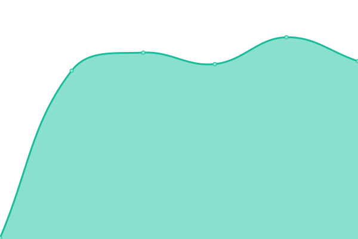

# [📈 Live Status](https://status.zombiegraphique.com): <!--live status--> **🟧 Partial outage**

This repository contains the open-source uptime monitor and status page for [Zombie Solutions Technologiques](https://zombie.technology), powered by [Upptime](https://github.com/upptime/upptime).

With [Upptime](https://upptime.js.org), you can get your own unlimited and free uptime monitor and status page, powered entirely by a GitHub repository. We use [Issues](https://github.com/Zombie-Technology/uptime/issues) as incident reports, [Actions](https://github.com/Zombie-Technology/uptime/actions) as uptime monitors, and [Pages](https://status.zombiegraphique.com) for the status page.

<!--start: status pages-->
<!-- This summary is generated by Upptime (https://github.com/upptime/upptime) -->
<!-- Do not edit this manually, your changes will be overwritten -->
<!-- prettier-ignore -->
| URL | Status | History | Response Time | Uptime |
| --- | ------ | ------- | ------------- | ------ |
|  [Zombie Graphique Inc](https://www.zombiegraphique.com) | 🟥 Down | [zombie-graphique-inc.yml](https://github.com/Zombie-Technology/uptime/commits/HEAD/history/zombie-graphique-inc.yml) | 

 158ms
     
 | 

<a href="https://status.zombiegraphique.com/history/zombie-graphique-inc">0.40%</a>
    

|  [ZombieGraphique CRM](https://crm.zombiegraphique.com) | 🟩 Up | [zombie-graphique-crm.yml](https://github.com/Zombie-Technology/uptime/commits/HEAD/history/zombie-graphique-crm.yml) | 

 319ms
     
 | 

<a href="https://status.zombiegraphique.com/history/zombie-graphique-crm">100.00%</a>
    

|  [Hypnose Nancy Gagnon](https://www.hypnonancy.com) | 🟩 Up | [hypnose-nancy-gagnon.yml](https://github.com/Zombie-Technology/uptime/commits/HEAD/history/hypnose-nancy-gagnon.yml) | 

 699ms
     
 | 

<a href="https://status.zombiegraphique.com/history/hypnose-nancy-gagnon">100.00%</a>
    

|  [BardQ.com](https://bardq.com) | 🟩 Up | [bard-q-com.yml](https://github.com/Zombie-Technology/uptime/commits/HEAD/history/bard-q-com.yml) | 

 269ms
     
 | 

<a href="https://status.zombiegraphique.com/history/bard-q-com">100.00%</a>
    

|  [BarQ.ca](https://bardq.ca) | 🟩 Up | [bar-q-ca.yml](https://github.com/Zombie-Technology/uptime/commits/HEAD/history/bar-q-ca.yml) | 

 250ms
     
 | 

<a href="https://status.zombiegraphique.com/history/bar-q-ca">100.00%</a>
    

|  [beautedesiles.ca](https://beautedesiles.ca/) | 🟩 Up | [beautedesiles-ca.yml](https://github.com/Zombie-Technology/uptime/commits/HEAD/history/beautedesiles-ca.yml) | 

 315ms
     
 | 

<a href="https://status.zombiegraphique.com/history/beautedesiles-ca">100.00%</a>
    

|  [Crazy Sign](https://crazysign.ca/) | 🟩 Up | [crazy-sign.yml](https://github.com/Zombie-Technology/uptime/commits/HEAD/history/crazy-sign.yml) | 

 312ms
     
 | 

<a href="https://status.zombiegraphique.com/history/crazy-sign">100.00%</a>
    

|  [ddupras](https://ddupras.com) | 🟥 Down | [ddupras.yml](https://github.com/Zombie-Technology/uptime/commits/HEAD/history/ddupras.yml) | 

 0ms
     
 | 

<a href="https://status.zombiegraphique.com/history/ddupras">0.33%</a>
    

|  [Diamand](https://diamand.ca) | 🟩 Up | [diamand.yml](https://github.com/Zombie-Technology/uptime/commits/HEAD/history/diamand.yml) | 

 158ms
     
 | 

<a href="https://status.zombiegraphique.com/history/diamand">100.00%</a>
    

|  [DiagDiesel](https://diagdiesel.com) | 🟩 Up | [diag-diesel.yml](https://github.com/Zombie-Technology/uptime/commits/HEAD/history/diag-diesel.yml) | 

 273ms
     
 | 

<a href="https://status.zombiegraphique.com/history/diag-diesel">100.00%</a>
    

|  [Eso-sense](https://eso-sense.com) | 🟥 Down | [eso-sense.yml](https://github.com/Zombie-Technology/uptime/commits/HEAD/history/eso-sense.yml) | 

 0ms
     
 | 

<a href="https://status.zombiegraphique.com/history/eso-sense">0.57%</a>
    

|  [Groupe JFK](https://groupejfk.ca) | 🟩 Up | [groupe-jfk.yml](https://github.com/Zombie-Technology/uptime/commits/HEAD/history/groupe-jfk.yml) | 

 245ms
     
 | 

<a href="https://status.zombiegraphique.com/history/groupe-jfk">100.00%</a>
    

|  [Hellofaride](https://hellofaride.ca) | 🟥 Down | [hellofaride.yml](https://github.com/Zombie-Technology/uptime/commits/HEAD/history/hellofaride.yml) | 

 168ms
     
 | 

<a href="https://status.zombiegraphique.com/history/hellofaride">0.43%</a>
    

|  [Julio Pizza](https://julio.pizza) | 🟥 Down | [julio-pizza.yml](https://github.com/Zombie-Technology/uptime/commits/HEAD/history/julio-pizza.yml) | 

 121ms
     
 | 

<a href="https://status.zombiegraphique.com/history/julio-pizza">0.79%</a>
    

|  [Match PME](https://matchpme.ca) | 🟩 Up | [match-pme.yml](https://github.com/Zombie-Technology/uptime/commits/HEAD/history/match-pme.yml) | 

 403ms
     
 | 

<a href="https://status.zombiegraphique.com/history/match-pme">100.00%</a>
    

|  [Willkess Farm](https://wilkess.farm) | 🟥 Down | [willkess-farm.yml](https://github.com/Zombie-Technology/uptime/commits/HEAD/history/willkess-farm.yml) | 

 0ms
     
 | 

<a href="https://status.zombiegraphique.com/history/willkess-farm">0.75%</a>
    

|  [MJReno](https://mjreno.ca) | 🟩 Up | [mj-reno.yml](https://github.com/Zombie-Technology/uptime/commits/HEAD/history/mj-reno.yml) | 

 223ms
     
 | 

<a href="https://status.zombiegraphique.com/history/mj-reno">100.00%</a>
    

|  [Pave MC](https://pavemc.ca) | 🟥 Down | [pave-mc.yml](https://github.com/Zombie-Technology/uptime/commits/HEAD/history/pave-mc.yml) | 

 0ms
     
 | 

<a href="https://status.zombiegraphique.com/history/pave-mc">73.95%</a>
    

|  [O Boutte](https://oboutte.ca) | 🟥 Down | [o-boutte.yml](https://github.com/Zombie-Technology/uptime/commits/HEAD/history/o-boutte.yml) | 

 176ms
     
 | 

<a href="https://status.zombiegraphique.com/history/o-boutte">3.98%</a>
    

|  [MS Électromécanique](https://mselectromecanique.com) | 🟥 Down | [ms-electromecanique.yml](https://github.com/Zombie-Technology/uptime/commits/HEAD/history/ms-electromecanique.yml) | 

 0ms
     
 | 

<a href="https://status.zombiegraphique.com/history/ms-electromecanique">2.34%</a>
    

|  [Sheriff Ville](https://sherifville.com) | 🟩 Up | [sheriff-ville.yml](https://github.com/Zombie-Technology/uptime/commits/HEAD/history/sheriff-ville.yml) | 

 267ms
     
 | 

<a href="https://status.zombiegraphique.com/history/sheriff-ville">100.00%</a>
    

|  [Sub satori](https://subsatori.com) | 🟩 Up | [sub-satori.yml](https://github.com/Zombie-Technology/uptime/commits/HEAD/history/sub-satori.yml) | 

 486ms
     
 | 

<a href="https://status.zombiegraphique.com/history/sub-satori">100.00%</a>
    

|  [Stika](https://stika.ca) | 🟥 Down | [stika.yml](https://github.com/Zombie-Technology/uptime/commits/HEAD/history/stika.yml) | 

 3169ms
     
 | 

<a href="https://status.zombiegraphique.com/history/stika">38.25%</a>
    

|  [Spirales Boreales](https://spiralesboreales.com) | 🟥 Down | [spirales-boreales.yml](https://github.com/Zombie-Technology/uptime/commits/HEAD/history/spirales-boreales.yml) | 

 0ms
     
 | 

<a href="https://status.zombiegraphique.com/history/spirales-boreales">2.67%</a>
    

|  [Passion saveurs Keto](https://passionsaveursketo.ca) | 🟩 Up | [passion-saveurs-keto.yml](https://github.com/Zombie-Technology/uptime/commits/HEAD/history/passion-saveurs-keto.yml) | 

 414ms
     
 | 

<a href="https://status.zombiegraphique.com/history/passion-saveurs-keto">100.00%</a>
    

|  [WiFi QR](https://wifi.pin.plus) | 🟩 Up | [wi-fi-qr.yml](https://github.com/Zombie-Technology/uptime/commits/HEAD/history/wi-fi-qr.yml) | 

 313ms
     
 | 

<a href="https://status.zombiegraphique.com/history/wi-fi-qr">100.00%</a>
    

<!--end: status pages-->

[**Visit our status website →**](https://status.zombiegraphique.com)

## 📄 License

- Powered by: [Upptime](https://github.com/upptime/upptime)
- Code: [MIT](./LICENSE) © [Zombie Solutions Technologiques](https://zombie.technology)
- Data in the `./history` directory: [Open Database License](https://opendatacommons.org/licenses/odbl/1-0/)
