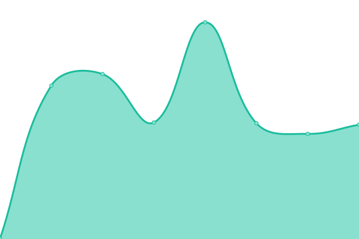

# [📈 Live Status](https://status.zombiegraphique.com): <!--live status--> **🟧 Partial outage**

This repository contains the open-source uptime monitor and status page for [Zombie Solutions Technologiques](https://zombie.technology), powered by [Upptime](https://github.com/upptime/upptime).

With [Upptime](https://upptime.js.org), you can get your own unlimited and free uptime monitor and status page, powered entirely by a GitHub repository. We use [Issues](https://github.com/Zombie-Technology/uptime/issues) as incident reports, [Actions](https://github.com/Zombie-Technology/uptime/actions) as uptime monitors, and [Pages](https://status.zombiegraphique.com) for the status page.

<!--start: status pages-->
<!-- This summary is generated by Upptime (https://github.com/upptime/upptime) -->
<!-- Do not edit this manually, your changes will be overwritten -->
<!-- prettier-ignore -->
| URL | Status | History | Response Time | Uptime |
| --- | ------ | ------- | ------------- | ------ |
|  [Zombie Graphique Inc](https://zombiegraphique.com) | 🟥 Down | [zombie-graphique-inc.yml](https://github.com/Zombie-Technology/uptime/commits/HEAD/history/zombie-graphique-inc.yml) | 

 105ms
     
 | 

<a href="https://status.zombiegraphique.com/history/zombie-graphique-inc">100.00%</a>
    

|  [Hypnose Nancy Gagnon](https://www.hypnonancy.com) | 🟩 Up | [hypnose-nancy-gagnon.yml](https://github.com/Zombie-Technology/uptime/commits/HEAD/history/hypnose-nancy-gagnon.yml) | 

 499ms
     
 | 

<a href="https://status.zombiegraphique.com/history/hypnose-nancy-gagnon">98.25%</a>
    

|  [Diamand](https://diamand.ca) | 🟩 Up | [diamand.yml](https://github.com/Zombie-Technology/uptime/commits/HEAD/history/diamand.yml) | 

 163ms
     
 | 

<a href="https://status.zombiegraphique.com/history/diamand">98.25%</a>
    

|  [Julio Pizza](https://julio.pizza) | 🟥 Down | [julio-pizza.yml](https://github.com/Zombie-Technology/uptime/commits/HEAD/history/julio-pizza.yml) | 

 273ms
     
 | 

<a href="https://status.zombiegraphique.com/history/julio-pizza">100.00%</a>
    

|  [Match PME](https://matchpme.ca) | 🟩 Up | [match-pme.yml](https://github.com/Zombie-Technology/uptime/commits/HEAD/history/match-pme.yml) | 

 436ms
     
 | 

<a href="https://status.zombiegraphique.com/history/match-pme">98.25%</a>
    

|  [Willkess Farm](https://willkess.farm) | 🟩 Up | [willkess-farm.yml](https://github.com/Zombie-Technology/uptime/commits/HEAD/history/willkess-farm.yml) | 

 322ms
     
 | 

<a href="https://status.zombiegraphique.com/history/willkess-farm">98.25%</a>
    

|  [MJReno](https://mjreno.ca) | 🟩 Up | [mj-reno.yml](https://github.com/Zombie-Technology/uptime/commits/HEAD/history/mj-reno.yml) | 

 252ms
     
 | 

<a href="https://status.zombiegraphique.com/history/mj-reno">98.25%</a>
    

|  [Sheriff Ville](https://sherifville.com) | 🟩 Up | [sheriff-ville.yml](https://github.com/Zombie-Technology/uptime/commits/HEAD/history/sheriff-ville.yml) | 

 263ms
     
 | 

<a href="https://status.zombiegraphique.com/history/sheriff-ville">98.25%</a>
    

|  [Sub satori](https://subsatori.com) | 🟩 Up | [sub-satori.yml](https://github.com/Zombie-Technology/uptime/commits/HEAD/history/sub-satori.yml) | 

 322ms
     
 | 

<a href="https://status.zombiegraphique.com/history/sub-satori">98.25%</a>
    

|  [Passion saveurs Keto](https://passionsaveursketo.ca) | 🟥 Down | [passion-saveurs-keto.yml](https://github.com/Zombie-Technology/uptime/commits/HEAD/history/passion-saveurs-keto.yml) | 

 340ms
     
 | 

<a href="https://status.zombiegraphique.com/history/passion-saveurs-keto">91.52%</a>
    

|  [Coiffure de la tourelle](https://coiffuredelatourelle.com) | 🟩 Up | [coiffure-de-la-tourelle.yml](https://github.com/Zombie-Technology/uptime/commits/HEAD/history/coiffure-de-la-tourelle.yml) | 

 398ms
     
 | 

<a href="https://status.zombiegraphique.com/history/coiffure-de-la-tourelle">100.00%</a>
    

|  [WiFi QR](https://wifi.pin.plus) | 🟩 Up | [wi-fi-qr.yml](https://github.com/Zombie-Technology/uptime/commits/HEAD/history/wi-fi-qr.yml) | 

 609ms
     
 | 

<a href="https://status.zombiegraphique.com/history/wi-fi-qr">99.80%</a>
    

<!--end: status pages-->

[**Visit our status website →**](https://status.zombiegraphique.com)

## 📄 License

- Powered by: [Upptime](https://github.com/upptime/upptime)
- Code: [MIT](./LICENSE) © [Zombie Solutions Technologiques](https://zombie.technology)
- Data in the `./history` directory: [Open Database License](https://opendatacommons.org/licenses/odbl/1-0/)
